## CIDA - Control Infrastructure for Distributed Algorithms

  What presents before you is the documentation of CIDA, a Control Infrastructure for Distributed Algorithms.

  CIDA has the ambition to aid the learning and understanding a distributed algorithm's inner workings. 

  CIDA is a two-tier architecture, with the basic layer sitting on top of the control layer. 

   The idea behind having two layers is to allow the user of the interface to use the basic layer to implement its algorithm while the control layer works behind the scenes and has a probabilistic or clock signaled algorithm to inform the user of the algorithm's evolution, such as deadlock detection or termination detection. 

### Introduction 

  The way to implement a distributed algorithm is to first define a distributed system. A distributed system is one such that
  various components are spread across multiple computers, or processors, and these perform independent computations. In a distributed system, the collection of processors do not share memory, nor are synched by a global clock. 
  In CIDA, the available procedures are prefixed by "ci_" (control interface) and sufixed by the designed operation.

#### Conventions
  By having CIDA work on top of MPI, some architectural decisions were made that are not fail-safe. 

  The available datatypes of the message payload are: <text>**ci\_char**, **ci\_short**, **ci\_int**, **ci\_long**, **ci\_long\_long\_int**, **ci\_long\_long**, **ci\_signed\_char**, **ci\_unsigned\_char**, **ci\_unsigned\_short**, **ci\_unsigned**, **ci\_unsigned\_long**, **ci\_unsigned\_long\_long**, **ci\_float**, **ci\_double**, **ci\_long\_double**, **ci\_wchar**.
</text>

#### Point-to-Point Communication

  Although CIDA's procedures issue MPI procedures, the first tries to gather some information about the payload and the channel in which the operation is taking place.
  A message is defined by a pointer to its buffer, its datatype and the number of elements in the given buffer. In addition to the data part, messages carry information that can be used to distinguish messages and selectively receive them. This information is called the **message envelope** and its composed of the following fields { *source*, *destination*, *tag* }.


### Topology

  To whomever plans on using this library, should know about the feature to define a network and be should very aware that it's the only way the data flows. The user can define the topology it pleases the most with the following allowed components.
  The uncapitalized version of a component means the edges are directed and its counter-part, the capitalized version, undirected.

  ```
    e, E            -- edge
    r, R            -- ring
    C               -- clique
    i               -- initiator
  ```

#### Edge
  There are six ways to define edges, half being for directed and the other half for undirected edges.

  ---

  - A directed edge, from A to B with A and B being positive integers.

  

  ```
  e A B
  ```

  ---

  - Many directed edges, from A to { B, C, D, E }, all being positive integers.

  

  ```
  e A B C D E
  ```

  ---

  - An outgoing directed edge from A to all the other nodes (processes).

  

  ```
  e A *
  ```
  ---

#### Ring

  In a similar fashion, there are 6 ways to define a ring. A ring, or a donut, is graph component that has the property of wrapping around.

  ---
  - A ring from A to B, also known as an undirected edge from A to B or two directed edges, one from A to B and the other from B to A, can be defined as follows, keep in mind that positive integers should be used.

  

  ```
  r A B
  ```

  ---
  - A ring from A to { B, C, D E } can be represented as follows:

  

  ```
  r A B C D E
  ```

  ---

  - A ring from A to all the other nodes, using a `*` similar to a wildcard:

  

  ```
  r A *
  ```

  ---

#### Clique

  A clique only makes sense to be used in two ways, and does not have a directed version.

  ----

  - A clique that makes of { A, B, C, D}:

  

  ```
  C A B C D
  ```

  ----

  - A clique that makes of all available nodes:

  

  In this case, (...), is another graph component that still respects the clique property, but visual purposes, and sanity, it has been shrunk down.

  ```
  C *
  ```

  ----

#### Initiator

  Given the nature of things there is a need to define, in the control algorithms, which node or process is an initiator to perform some preparation. 

  Initiators can be defined using the `*` keyword.
  The node, or process, is then marked for future possible candidate in the random pool of initiators.

  ----

  - Definition of a single initiator:

  

  ```
  i A
  ```

  ----

  - Definition of a multiple initiators:

  

  ```
  i A B D F
  ```

  ----

  - Definition of all initiators:

  

  ```
  i * 
  ```

  ----

### Sending messages

  The CIDA interface, like the Message-Passing Interface, offers methods that allow payloads to be sent from one processor to another.
  There are two sorts of send operations: synchronous and asynchronous. Synchronous send actions can be strictly synchronous or undefined. Asynchronous send operations return immediately.
  The latter does not guarantee that the message was received, and the user should test it with a command like ci\_wait(). 

#### Synchronous
  The synchronous send can be stricly synchronous or undefined, the first one blocks the sender until the receipt has received the message. 
  Undefined reverts to MPI's standard send, it can either issue a buffered send or a synchronous send. The decision is based on whether the buffer attached for buffered sends contains enough free space for the message to send. If there is enough space, a buffered send will be issued otherwise it will be issued a synchronous send.

  ```C
  int ci_send(generic buffer,           -- pointer to the buffer to send
              int count,                -- number of elements to send
              ci_datatype datatype,     -- type of one buffer element  
              int receiver,             -- rank of the receiver process
              int tag,                  -- tag to assign to the message
              communication_mode mode); -- communication mode { SYNC | UNDEF }
  ```
     
#### Asynchronous
  The asynchronous send is the non-blocking send, in this case is it not explicitly told wether to send the message in the synchronous mode or asynchronous mode. Instead, the decision will be made on whether there is enough space for the buffer to send, thus performing a synchronous non-blocking send. If there is not enough space the non-blocking send will be asynchronous.

  ```C
  int ci_isend(generic buffer,           -- pointer to the buffer to send
               int count,                -- number of elements to send
               ci_datatype datatype,     -- type of one buffer element  
               int receiver,             -- rank of the receiver process
               int tag,                  -- tag to assign to the message
               ci_request* request);     -- request handle on the non-blocking communication taking place
  ```

### Receiving messages

  To allow the reception of messages, there have been defined two procedures that allow blocking and non-blocking receive.

#### Synchronous
  ```C
  int ci_recv(generic buffer,         -- pointer to the buffer to receive
              int count,              -- number of elements to receive
              ci_datatype datatype,   -- type of one buffer element
              int sender,             -- rank of the sender process  { int | CI_ANY_SOURCE }
              int tag,                -- tag of the assigned message { int | CI_ANY_TAG }
              ci_status* status);     -- variable to store the status of the receive operation, can be NULL
  ```


#### Asynchronous
  ```C
  int ci_irecv(generic buffer,        -- pointer to the buffer to receive
               int count,             -- number of elements to receive
               ci_datatype datatype,  -- type of one buffer element
               int sender,            -- rank of the sender process   { int | CI_ANY_SOURCE }
               int tag,               -- tag of the assigned message. { int | CI_ANY_TAG }
               ci_status* status);    -- variable to store the status of the receive operation, can be NULL.
  ```

### Miscellaneous

  In order to make CIDA more complete, there have been defined some miscellaneous procedures that allow the user to obtain some information about the graphs topology.

  ```C
  int ci_get_number_predecessors(); -- number of predecessors of the calling process
  int ci_get_number_successors();   -- number of successors of the calling process

  int* ci_get_predecessors();       -- pointer to the predecessors of the calling process
  int* ci_get_successors();         -- pointer to the sucessors of the calling process

  void ci_print_graph();            -- prints the sucessors of each process, it is recommended that 
                                       only one process calls this function.
  ```

  Users might want to consider using a procedure defined to be used when there's a need to print to the `stdout`.

  ```C
  void ci_print(char* format, ...);
  ```

  Essentially it wraps the message to be printed in a nice way.
  ```
  [HH:MM:SS.MS; P - 0] Hello from CIDA. 
  ```


#### Probing

  Probe routines obtain information about a message waiting for reception, without actually receiving it. When called, it can retrieve some information about the message such as its Tag and its Source.

  Similar to other operations, it's split into two operations modes, a synchronous and asynchronours.

  ```C
  int ci_probe(int source,         -- rank of the sender process
               int tag,            -- tag assigned to the messsage
               ci_status* status); -- variable to store the status of the probe operation, can be NULL.
  ```

  ```C
  int ci_iprobe(int source,         -- rank of the sender process
               int tag,            -- tag assigned to the messsage
               int* flag,          -- flag indicating that there is a message waiting for reception { 0, 1 }.
               ci_status* status); -- variable to store the status of the probe operation, can be NULL.
  ```

#### Barrier Communication

  Sometimes it's useful to have some sense of synchronization, we can achieve such by having a barrier, telling the process that reaches that routine to wait for all the other processes to do so.

  ```C
  int ci_barrier( );
  ```

### Error Handling

  ```
  Returns CI_EXIT_SUCCESS if the routine successfully completed.
  Returns CI_EXIT_FAILURE if the routine failed to complete.
  ```


