### Example - Election

This page is reserved for a program example that runs the election algorithm.

#### Topology

The election algorithm can run on an arbitrary network. Take the following topology as an example.

```
R 0 3
R 4 9
E 5 7
e 1 3
i *
```



#### Code

The code can be something along the lines of:

```C
#include <stdio.h>
#include <stdlib.h>
#include <string.h>
#include <unistd.h>

#define POOL_SIZE 10

#include "cida.h"

int main(int argc, char** argv)
{
  ci_init(&argc, &argv);

  int comm_size = ci_size();

  if( comm_size != POOL_SIZE )
  {
    fprintf(stderr, "This application is meant to be run with 10 processes\n");
    return EXIT_FAILURE;
  }

  // unique ids 
  int unique_ids[POOL_SIZE] = {0, -1, 2, 4, 10, 1, 30, 5, -2, 6};

  // array of candidates
  bool candidates[POOL_SIZE] = {true,  false, true, true,  false,
                                false, true,  true, false, true};

  // call election algorithm
  int leader = ci_election(unique_ids[ci_rank( )], candidates, POOL_SIZE);

  ci_print("Leader: %d\n", leader);

  ci_barrier( );
  ci_finalize( );

  return EXIT_SUCCESS;
}
```

#### Execution

Provided the Makefile, the program can be compiled with:

` make election_example ` 

and executed with:

`mpirun -np 10 election_example`

#### Expected Output

The expected output is 10 lines with each processor printing its leader.
```
[HH:MM:SS.MS; P - 0] Leader: 3
[HH:MM:SS.MS; P - 1] Leader: 3
[HH:MM:SS.MS; P - 2] Leader: 3
[HH:MM:SS.MS; P - 3] Leader: 3
[HH:MM:SS.MS; P - 4] Leader: 6
[HH:MM:SS.MS; P - 5] Leader: 6
[HH:MM:SS.MS; P - 6] Leader: 6
[HH:MM:SS.MS; P - 7] Leader: 6
[HH:MM:SS.MS; P - 8] Leader: 6
[HH:MM:SS.MS; P - 9] Leader: 6
```

